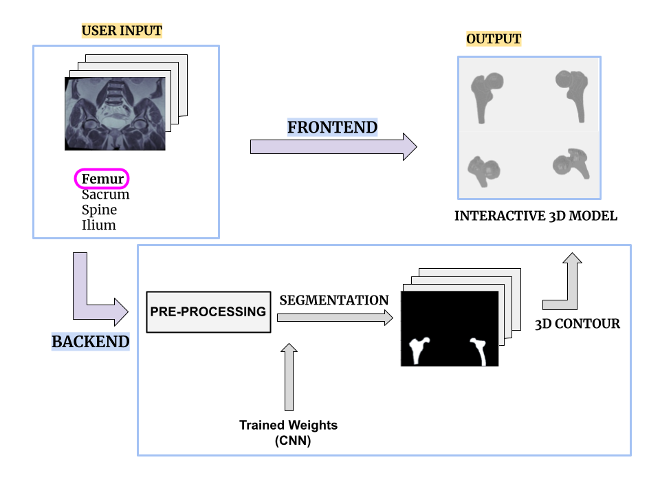

# Pelvic Region 3D MRI Scan Bone Segmentation Website

## The Project Flowchart

The objective of this project is to perform automatic multi-class bone segmentation on pelvic MRI dataset using deep learning models. Each pixel is assigned to one of the following classes.

Classes:

0. background
1. femur
2. ilium
3. spine
4. sacrum

The objectives of the binary segmentation projects are to perform automatic binary bone segmentation on pelvic MRI dataset. Each pixel is assigned to one of the two classes.

Classes:

0. background
1. bone

The binary segmentation project is done for each type of the bone visible in the pelvic MRI (femur, ilium, spine, sacrum). 

## Segmenation Mask

Finished working on creating manual segmentation mask for bone segmentation project. The final segmented mask is under the mask folder. The folder contains binary segmented masks and multiclass segmented masks.

## Model

2D models
- U-Net with ResNet-34 as encoder
- DeepLabV3
- Segmenter (still in progress)

Set the model type ('unet', 'deeplabv3') and set the variable training to True to train the specific model.

3D models
- U-NET

## Results

2D binary and multi-class segmentation acheiving dice score of 0.7-0.9. Trained for 30 epochs. Check out the figs/boxplots directory for boxplot result for each model and bone segmentation. More documentation will be added under this section in the future.

## 2D to 3D Model

A .tif file is created by stacking all the 2D predicted masks. Then, 3D isosurface is created. Then, the triangulation method is used to save the 3D model in .stl file. Please refer to mask/patient05/image_viewer3d.m MATLAB code.

## Website

It uses the .stl file created in the previous step. As of now, .stl file must be converted to .gltf through an external source, but we plan to fix this issue soon. A simple website has been created. It is able to load an example model and provide 3D interactable display. 

## Future Plans

The final goal is to create a website that takes in pelvic MRI scan that consists of multiple 2D slices and outputs an interactable 3D display of the bone the user chooses (femur, spine, sacrum, ilium). There needs to be a smooth transition along the whole process in the backend. 

We plan to continue adding more features to the website.